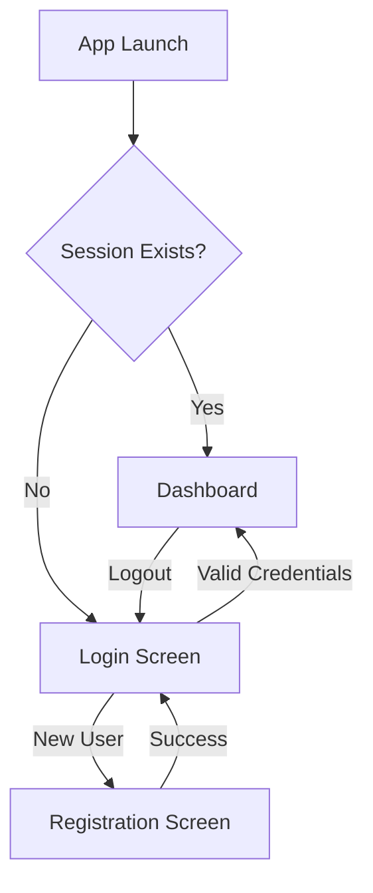
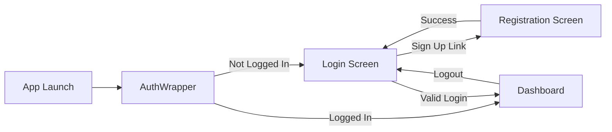

# LAB 5 – AUTHENTICATION SYSTEM
## Login, Registration & Logout with Firebase Authentication

---

**Name:** [Your Name]  
**Enrollment No:** [Your Enrollment Number]  
**Subject:** Mobile Application Development  
**Course:** [Your Course Name]  
**Date:** January 25, 2026

---

## 🎯 AIM

To design and implement a functional user authentication system including **Login**, **Registration**, **Logout**, and **Session Management** using **Firebase Authentication** in a Flutter mobile application.

---

## 📚 THEORY

### What is Firebase Authentication?

Firebase Authentication is a backend service provided by Google Firebase that makes it easy to authenticate users in mobile and web applications. It provides:

- **Multiple authentication methods** (Email/Password, Google, Facebook, etc.)
- **Secure user management** with industry-standard security
- **Session management** with automatic token refresh
- **Easy integration** with other Firebase services

### Authentication Flow



### Key Concepts

#### 1. **User Registration**
- Creates a new user account with email and password
- Uses `createUserWithEmailAndPassword()` method
- Validates email format and password strength
- Stores user credentials securely in Firebase

#### 2. **User Login**
- Authenticates existing users
- Uses `signInWithEmailAndPassword()` method
- Validates credentials against Firebase database
- Creates a session token for authenticated access

#### 3. **User Logout**
- Terminates the current user session
- Uses `signOut()` method
- Clears local session data
- Redirects to login screen

#### 4. **Session Management**
- Uses **SharedPreferences** to store login state locally
- Checks authentication status on app startup
- Implements auto-login for returning users
- Provides seamless user experience

### Firebase Authentication Error Handling

| Error Code | Description | User-Friendly Message |
|------------|-------------|----------------------|
| `weak-password` | Password is too weak | "Password must be stronger" |
| `email-already-in-use` | Email already registered | "Account already exists" |
| `user-not-found` | No account with this email | "No account found" |
| `wrong-password` | Incorrect password | "Incorrect password" |
| `invalid-email` | Email format is invalid | "Invalid email address" |

---

## 🔧 IMPLEMENTATION

### STEP 1: Firebase Setup

#### 1.1 Create Firebase Project

1. Go to [Firebase Console](https://console.firebase.google.com/)
2. Click **"Add project"**
3. Enter project name: **"KrushiAI"**
4. Disable Google Analytics (optional for this lab)
5. Click **"Create project"**

#### 1.2 Add Android App to Firebase

1. In Firebase Console, click **Android icon**
2. Enter Android package name: `com.example.krushi_ai`
   - Find this in `android/app/build.gradle` under `applicationId`
3. Enter app nickname: **"KrushiAI"** (optional)
4. Click **"Register app"**

#### 1.3 Download google-services.json

1. Download the `google-services.json` file
2. Place it in: `android/app/` directory
3. **Important:** Do NOT place it in `android/` root directory

#### 1.4 Configure Android Project

**File: `android/build.gradle`**

Add Google Services classpath:

```gradle
buildscript {
    dependencies {
        // Add this line
        classpath 'com.google.gms:google-services:4.4.0'
    }
}
```

**File: `android/app/build.gradle`**

Add plugin at the bottom:

```gradle
apply plugin: 'com.android.application'
apply plugin: 'kotlin-android'
apply from: "$flutterRoot/packages/flutter_tools/gradle/flutter.gradle"

// Add this line at the bottom
apply plugin: 'com.google.gms.google-services'
```

Also update minSdkVersion to 21:

```gradle
defaultConfig {
    minSdkVersion 21  // Changed from flutter.minSdkVersion
}
```

#### 1.5 Enable Email/Password Authentication

1. In Firebase Console, go to **Authentication**
2. Click **"Get started"**
3. Go to **"Sign-in method"** tab
4. Click **"Email/Password"**
5. Enable **"Email/Password"**
6. Click **"Save"**

#### 1.6 Add Flutter Dependencies

**File: `pubspec.yaml`**

```yaml
dependencies:
  flutter:
    sdk: flutter
  
  # Firebase dependencies
  firebase_core: ^3.8.1
  firebase_auth: ^5.3.3
  
  # Session management
  shared_preferences: ^2.2.2
```

Run command:
```bash
flutter pub get
```

---

### STEP 2: Project Structure

```
lib/
├── main.dart                          # App entry point with Firebase init
├── screens/
│   ├── auth_wrapper.dart             # Session check & auto-login
│   ├── login/
│   │   └── login_screen.dart         # Login UI & logic
│   ├── registration/
│   │   └── registration_screen.dart  # Registration UI & logic
│   └── dashboard/
│       └── dashboard_screen.dart     # Home screen with logout
├── services/
│   └── auth_service.dart             # Firebase auth operations
├── utils/
│   └── validators.dart               # Form validation functions
└── widgets/
    ├── custom_text_field.dart        # Reusable text input
    └── custom_button.dart            # Reusable button
```

---

### STEP 3: Code Implementation

#### 3.1 Validation Utilities

**File: `lib/utils/validators.dart`**

```dart
class Validators {
  /// Validates email format using regex pattern
  static String? validateEmail(String? value) {
    if (value == null || value.isEmpty) {
      return 'Email is required';
    }

    final emailRegex = RegExp(
      r'^[a-zA-Z0-9._%+-]+@[a-zA-Z0-9.-]+\.[a-zA-Z]{2,}$',
    );

    if (!emailRegex.hasMatch(value)) {
      return 'Please enter a valid email address';
    }

    return null;
  }

  /// Validates password length (minimum 6 characters)
  static String? validatePassword(String? value) {
    if (value == null || value.isEmpty) {
      return 'Password is required';
    }

    if (value.length < 6) {
      return 'Password must be at least 6 characters';
    }

    return null;
  }

  /// Validates password match
  static String? validatePasswordMatch(
    String? password, 
    String? confirmPassword
  ) {
    if (confirmPassword == null || confirmPassword.isEmpty) {
      return 'Please confirm your password';
    }

    if (password != confirmPassword) {
      return 'Passwords do not match';
    }

    return null;
  }
}
```

**Explanation:**
- `validateEmail()`: Uses regex to check valid email format
- `validatePassword()`: Ensures minimum 6 character length
- `validatePasswordMatch()`: Compares password and confirm password fields

---

#### 3.2 Authentication Service

**File: `lib/services/auth_service.dart`**

render_diffs(file:///d:/CHARUSAT/Sem-6/MAD/KrushiAI/krushi_ai/lib/services/auth_service.dart)

**Key Methods:**

1. **`registerUser()`** - Creates new user account
   - Calls `createUserWithEmailAndPassword()`
   - Updates user display name
   - Saves session to SharedPreferences
   - Returns success message or throws error

2. **`loginUser()`** - Authenticates existing user
   - Calls `signInWithEmailAndPassword()`
   - Saves session to SharedPreferences
   - Returns success message or throws error

3. **`logoutUser()`** - Signs out current user
   - Calls `signOut()`
   - Clears session from SharedPreferences
   - Returns success message

4. **`checkSession()`** - Checks if user is logged in
   - Reads from SharedPreferences
   - Verifies Firebase auth state
   - Used for auto-login on app startup

**Singleton Pattern:**
- Uses factory constructor to ensure single instance
- Prevents multiple auth service instances
- Maintains consistent auth state across app

---

#### 3.3 Main Application Entry

**File: `lib/main.dart`**

render_diffs(file:///d:/CHARUSAT/Sem-6/MAD/KrushiAI/krushi_ai/lib/main.dart)

**Key Points:**
- `WidgetsFlutterBinding.ensureInitialized()` - Required before async operations
- `Firebase.initializeApp()` - Initializes Firebase SDK
- `AuthWrapper` - Initial screen that checks session
- Named routes for navigation between screens

---

#### 3.4 Auth Wrapper (Session Management)

**File: `lib/screens/auth_wrapper.dart`**

```dart
class AuthWrapper extends StatefulWidget {
  const AuthWrapper({super.key});

  @override
  State<AuthWrapper> createState() => _AuthWrapperState();
}

class _AuthWrapperState extends State<AuthWrapper> {
  final AuthService _authService = AuthService();
  bool _isChecking = true;

  @override
  void initState() {
    super.initState();
    _checkAuthStatus();
  }

  Future<void> _checkAuthStatus() async {
    try {
      final hasSession = await _authService.checkSession();
      
      await Future.delayed(const Duration(milliseconds: 500));

      if (mounted) {
        setState(() {
          _isChecking = false;
        });

        if (hasSession) {
          Navigator.pushReplacementNamed(context, '/dashboard');
        } else {
          Navigator.pushReplacementNamed(context, '/login');
        }
      }
    } catch (e) {
      if (mounted) {
        setState(() {
          _isChecking = false;
        });
        Navigator.pushReplacementNamed(context, '/login');
      }
    }
  }

  @override
  Widget build(BuildContext context) {
    return Scaffold(
      body: Center(
        child: CircularProgressIndicator(),
      ),
    );
  }
}
```

**Explanation:**
- Checks session on app startup
- Shows loading indicator while checking
- Navigates to Dashboard if logged in
- Navigates to Login if not logged in
- Implements auto-login functionality

---

#### 3.5 Registration Screen

**File: `lib/screens/registration/registration_screen.dart`**

**Key Features:**
- Form with 4 fields: Full Name, Email, Password, Confirm Password
- Real-time validation using Validators class
- Error message display
- Loading state during registration
- Navigation to login after success

**Registration Logic:**

```dart
Future<void> _handleRegistration() async {
  setState(() {
    _errorMessage = null;
  });

  if (!_validateForm()) {
    return;
  }

  setState(() {
    _isLoading = true;
  });

  try {
    final message = await _authService.registerUser(
      email: _emailController.text.trim(),
      password: _passwordController.text,
      fullName: _fullNameController.text.trim(),
    );

    setState(() {
      _isLoading = false;
    });

    if (mounted) {
      ScaffoldMessenger.of(context).showSnackBar(
        SnackBar(
          content: Text(message),
          backgroundColor: const Color(0xFF4CAF50),
        ),
      );

      Navigator.pushReplacementNamed(context, '/login');
    }
  } catch (e) {
    setState(() {
      _isLoading = false;
      _errorMessage = e.toString();
    });
  }
}
```

**Validation Flow:**
1. Clear previous errors
2. Validate all form fields
3. Show loading indicator
4. Call Firebase registration
5. Show success message
6. Navigate to login screen
7. Handle errors and display to user

---

#### 3.6 Login Screen

**File: `lib/screens/login/login_screen.dart`**

**Key Features:**
- Email and password input fields
- Password visibility toggle
- Form validation
- Error message display
- Loading state during login
- Navigation to registration
- Navigation to dashboard on success

**Login Logic:**

```dart
Future<void> _handleLogin() async {
  setState(() {
    _errorMessage = null;
  });

  if (!_validateInputs()) {
    return;
  }

  setState(() {
    _isLoading = true;
  });

  try {
    final message = await _authService.loginUser(
      email: _emailController.text.trim(),
      password: _passwordController.text,
    );

    setState(() {
      _isLoading = false;
    });

    if (mounted) {
      ScaffoldMessenger.of(context).showSnackBar(
        SnackBar(
          content: Text(message),
          backgroundColor: const Color(0xFF4CAF50),
        ),
      );

      Navigator.pushReplacementNamed(context, '/dashboard');
    }
  } catch (e) {
    setState(() {
      _isLoading = false;
      _errorMessage = e.toString();
    });
  }
}
```

---

#### 3.7 Dashboard with Logout

**File: `lib/screens/dashboard/dashboard_screen.dart`**

**Logout Implementation:**

```dart
Future<void> _handleLogout(BuildContext context) async {
  final shouldLogout = await showDialog<bool>(
    context: context,
    builder: (context) => AlertDialog(
      title: const Text('Logout'),
      content: const Text('Are you sure you want to logout?'),
      actions: [
        TextButton(
          onPressed: () => Navigator.pop(context, false),
          child: const Text('Cancel'),
        ),
        TextButton(
          onPressed: () => Navigator.pop(context, true),
          child: const Text('Logout', style: TextStyle(color: Colors.red)),
        ),
      ],
    ),
  );

  if (shouldLogout == true) {
    try {
      final authService = AuthService();
      await authService.logoutUser();

      if (context.mounted) {
        Navigator.pushNamedAndRemoveUntil(
          context,
          '/login',
          (route) => false,
        );
      }
    } catch (e) {
      if (context.mounted) {
        ScaffoldMessenger.of(context).showSnackBar(
          SnackBar(
            content: Text(e.toString()),
            backgroundColor: Colors.red,
          ),
        );
      }
    }
  }
}
```

**Features:**
- Confirmation dialog before logout
- Clears Firebase session
- Clears SharedPreferences
- Removes all previous routes
- Navigates to login screen

---

## 📱 NAVIGATION FLOW



### Route Configuration

| Route Name | Screen | Purpose |
|------------|--------|---------|
| `/` (home) | AuthWrapper | Check session & auto-login |
| `/login` | LoginScreen | User authentication |
| `/register` | RegistrationScreen | New user signup |
| `/dashboard` | DashboardScreen | Main app screen |

---

## 🧪 TESTING & VERIFICATION

### Manual Test Cases

#### Test Case 1: User Registration

**Steps:**
1. Launch the app
2. Tap "Sign Up" on login screen
3. Fill registration form:
   - Full Name: "Test User"
   - Email: "test@example.com"
   - Password: "password123"
   - Confirm Password: "password123"
4. Tap "Register" button

**Expected Result:**
- ✅ User registered successfully
- ✅ Success message displayed
- ✅ Navigated to login screen
- ✅ User visible in Firebase Console

---

#### Test Case 2: Registration Validation

**Steps:**
1. On registration screen, test each validation:
   - Leave fields empty → "Field required" error
   - Enter "invalid-email" → "Invalid email format"
   - Enter "12345" → "Password must be at least 6 characters"
   - Password: "password123", Confirm: "password456" → "Passwords do not match"

**Expected Result:**
- ✅ All validation messages display correctly
- ✅ Register button disabled until valid
- ✅ Inline error messages shown

---

#### Test Case 3: User Login

**Steps:**
1. On login screen, enter:
   - Email: "test@example.com"
   - Password: "password123"
2. Tap "Log In" button

**Expected Result:**
- ✅ User authenticated successfully
- ✅ Success message displayed
- ✅ Navigated to dashboard
- ✅ Session saved

---

#### Test Case 4: Login Error Handling

**Steps:**
1. Enter wrong password → "Incorrect password"
2. Enter non-existent email → "No account found"
3. Enter invalid email format → "Invalid email address"

**Expected Result:**
- ✅ Appropriate error messages displayed
- ✅ User remains on login screen
- ✅ Can retry login

---

#### Test Case 5: Session Persistence

**Steps:**
1. Login successfully
2. Close app completely
3. Reopen app

**Expected Result:**
- ✅ User automatically logged in
- ✅ Directly navigated to dashboard
- ✅ No login screen shown

---

#### Test Case 6: Logout Functionality

**Steps:**
1. From dashboard, tap logout icon
2. Confirm logout in dialog
3. Reopen app

**Expected Result:**
- ✅ Confirmation dialog shown
- ✅ User logged out successfully
- ✅ Navigated to login screen
- ✅ Session cleared
- ✅ Login screen shown on reopen

---

## 📊 OUTPUT SCREENSHOTS

> **Note:** After running the app, capture screenshots of:
> 1. Registration Screen
> 2. Registration with validation errors
> 3. Login Screen
> 4. Login with error message
> 5. Dashboard Screen
> 6. Logout confirmation dialog
> 7. Firebase Console showing registered user

**Screenshot Placeholders:**

```
[Insert Screenshot 1: Registration Screen]
[Insert Screenshot 2: Login Screen]
[Insert Screenshot 3: Dashboard with Logout]
[Insert Screenshot 4: Firebase Console - Users]
```

---

## 🔍 CODE EXPLANATION

### Key Flutter Concepts Used

#### 1. **StatefulWidget**
- Used for screens with changing state (loading, errors)
- Allows UI updates with `setState()`
- Manages form controllers and validation

#### 2. **TextEditingController**
- Manages text input field values
- Allows reading and clearing text
- Must be disposed to prevent memory leaks

#### 3. **async/await**
- Handles asynchronous Firebase operations
- Prevents UI blocking during network calls
- Enables proper error handling with try-catch

#### 4. **Navigator**
- Manages screen navigation
- `pushNamed()` - Navigate to new screen
- `pushReplacementNamed()` - Replace current screen
- `pushNamedAndRemoveUntil()` - Clear navigation stack

#### 5. **SharedPreferences**
- Stores key-value pairs locally
- Persists data across app sessions
- Used for session management

#### 6. **Form Validation**
- Validates user input before submission
- Provides user-friendly error messages
- Prevents invalid data submission

---

## 🎓 LEARNING OUTCOMES

After completing this lab, you have learned:

1. ✅ **Firebase Setup** - How to configure Firebase in Flutter project
2. ✅ **Authentication** - Implementing user registration and login
3. ✅ **Session Management** - Using SharedPreferences for auto-login
4. ✅ **Form Validation** - Creating reusable validation functions
5. ✅ **Error Handling** - Displaying user-friendly error messages
6. ✅ **Navigation** - Managing screen transitions and routes
7. ✅ **State Management** - Using setState for UI updates
8. ✅ **Async Programming** - Handling asynchronous operations
9. ✅ **Code Organization** - Structuring code with services and utilities
10. ✅ **User Experience** - Loading states and feedback messages

---

## 🚀 CONCLUSION

In this lab, we successfully implemented a complete authentication system using Firebase Authentication in Flutter. The system includes:

- **User Registration** with email/password and form validation
- **User Login** with credential verification and error handling
- **User Logout** with confirmation dialog and session clearing
- **Session Management** with auto-login functionality using SharedPreferences
- **Proper Navigation Flow** between authentication states

The implementation follows best practices including:
- Separation of concerns (services, utilities, UI)
- Reusable components (validators, custom widgets)
- Error handling with user-friendly messages
- Loading states for better UX
- Secure authentication with Firebase

This authentication system serves as a foundation for building secure mobile applications with user management capabilities.

---

## 📚 REFERENCES

1. [Firebase Authentication Documentation](https://firebase.google.com/docs/auth)
2. [Flutter Firebase Setup Guide](https://firebase.flutter.dev/docs/overview)
3. [Flutter Navigation and Routing](https://docs.flutter.dev/development/ui/navigation)
4. [SharedPreferences Package](https://pub.dev/packages/shared_preferences)
5. [Firebase Auth Package](https://pub.dev/packages/firebase_auth)

---

## 🔧 FIREBASE CONFIGURATION CHECKLIST

Before running the app, ensure:

- [ ] Firebase project created
- [ ] Android app added to Firebase
- [ ] `google-services.json` downloaded and placed in `android/app/`
- [ ] `android/build.gradle` updated with Google Services classpath
- [ ] `android/app/build.gradle` updated with Google Services plugin
- [ ] `minSdkVersion` set to 21 or higher
- [ ] Email/Password authentication enabled in Firebase Console
- [ ] `flutter pub get` executed successfully
- [ ] Internet permission added in `AndroidManifest.xml` (usually auto-added)

---

**Lab Completed Successfully! ✅**

---

*Submitted by: [Your Name]*  
*Date: January 25, 2026*  
*Instructor: [Instructor Name]*
